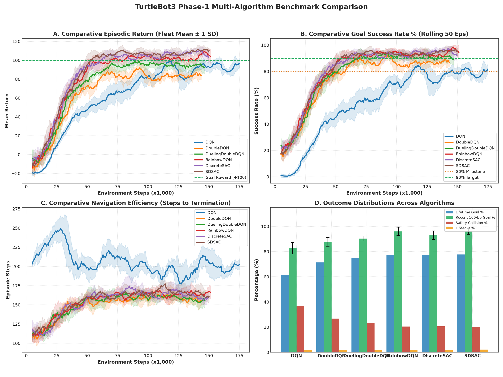
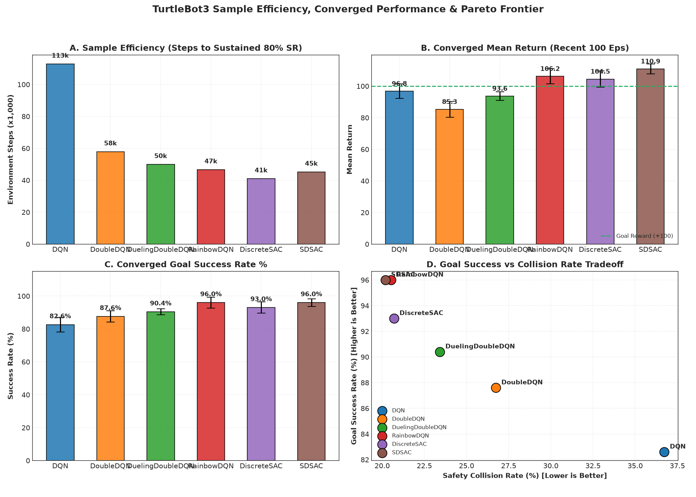

# Deep Reinforcement Learning & Preference Navigation Suite for TurtleBot3

[](https://www.python.org/downloads/)
[](https://docs.ros.org/en/foxy/)
[](http://gazebosim.org/)
[](https://pytorch.org/)
[](LICENSE)

An empirical research and deployment framework for point-to-point mapless navigation of non-holonomic mobile robots (TurtleBot3 Burger/Waffle Pi). This repository contains the complete implementation, benchmark comparisons, and deployment toolchain across six deep reinforcement learning algorithms:

1. **DQN** (Deep Q-Network, Mnih et al., 2015)
2. **Double DQN** (Van Hasselt et al., 2016)
3. **Dueling Double DQN** (Wang et al., 2016)
4. **Rainbow DQN** (Integrated multi-step returns & dueling streams, Hessel et al., 2018)
5. **SD-SAC** (Semi-Discrete Soft Actor-Critic)
6. **Discrete SAC** (Categorical Soft Actor-Critic with Bradley-Terry preference reward modeling & physical safety supervisor)

The suite covers simulation training in Gazebo 11, high-performance computing (HPC) orchestration via Apptainer/Singularity on Slurm clusters, and physical sim-to-real transfer with hardware safety watchdogs.

---

## Table of Contents
- [POMDP Formulation](#pomdp-formulation)
- [Algorithm Architectures](#algorithm-architectures)
- [Empirical Benchmarks](#empirical-benchmarks)
- [Reinforcement Learning from Human Feedback (RLHF)](#reinforcement-learning-from-human-feedback-rlhf)
- [Physical Robot Deployment](#physical-robot-deployment)
- [Repository Structure](#repository-structure)
- [Installation & Quickstart](#installation--quickstart)
- [Cluster Execution (Slurm / Apptainer)](#cluster-execution-slurm--apptainer)
- [Testing & Verification](#testing--verification)
- [Citation & Provenance](#citation--provenance)

---

## POMDP Formulation

The navigation task is modeled as a Partially Observable Markov Decision Process defined by the tuple $\langle \mathcal{S}, \mathcal{A}, \mathcal{P}, \mathcal{R}, \gamma \rangle$.

### Observation Space $\mathcal{S} \subset \mathbb{R}^{41}$
At each control timestep $t$, the agent receives a 41-dimensional normalized vector:

$$\mathbf{s}_t = \big[ \mathbf{z}_{\text{lidar}}, \bar{d}_g, \bar{\theta}_g, \cos(\theta_g), \bar{v}, \bar{\omega} \big] \in [0, 1]^{36} \times [0, 1] \times [-1, 1] \times [-1, 1] \times [0, 1] \times [-1, 1]$$

- **$\mathbf{z}_{\text{lidar}} \in [0, 1]^{36}$**: 36-beam range decimation derived from 360-degree 2D planar LiDAR ($10^\circ$ uniform angular resolution, spanning $[-180^\circ, +170^\circ]$ relative to the robot frame). Beam index 18 corresponds to $180^\circ$ (strictly forward heading). Raw distances $d \in [0.12, 3.50]\text{ m}$ are normalized:
  $$\bar{d} = \text{clip}\left(\frac{d - d_{\min}}{d_{\max} - d_{\min}}, 0.0, 1.0\right)$$
- **$\bar{d}_g \in [0, 1]$**: Euclidean distance to the Euclidean goal coordinate $(x_g, y_g)$, normalized against maximum stage distance $d_{\text{norm}} = 5.0\text{ m}$.
- **$\bar{\theta}_g \in [-1, 1]$**: Angular error between the robot's current yaw $\psi$ and the goal bearing $\theta = \text{atan2}(y_g - y, x_g - x)$, normalized by $\pi$:
  $$\bar{\theta}_g = \frac{\text{wrap}_{[-\pi, \pi]}(\theta - \psi)}{\pi}$$
- **$\cos(\theta_g) \in [-1, 1]$**: Orientation cosine feature ensuring smooth directional gradients across the discontinuity at $\pm \pi$.
- **$\bar{v} \in [0, 1]$**: Normalized linear velocity $\frac{v_t}{v_{\max}}$ with $v_{\max} = 0.22\text{ m/s}$.
- **$\bar{\omega} \in [-1, 1]$**: Normalized angular velocity $\frac{\omega_t}{\omega_{\max}}$ with $\omega_{\max} = 2.0\text{ rad/s}$.

### Action Space $\mathcal{A}$
The control interface uses $|\mathcal{A}| = 5$ discrete velocity primitives calibrated to the kinematic limits of the TurtleBot3 Burger:

| Action $a$ | Semantic Command | Linear Velocity $v$ (m/s) | Angular Velocity $\omega$ (rad/s) |
| :---: | :--- | :---: | :---: |
| **0** | Straight Forward | $0.22$ | $0.00$ |
| **1** | Soft Left | $0.18$ | $+0.60$ |
| **2** | Soft Right | $0.18$ | $-0.60$ |
| **3** | Hard Left | $0.08$ | $+1.50$ |
| **4** | Hard Right | $0.08$ | $-1.50$ |

### Simulation-Time Clock Decoupling
To eliminate numerical clock drift caused by the 10 Hz ROS 2 `/clock` topic under Gazebo ODE stepping, environment time is decoupled via the supremum of sensor arrival times:
$$t_{\text{sim}} = \max(t_{\text{scan}}, t_{\text{odom}})$$
A 500 Hz (2 ms) steady-time supervisor clock bounds action hold times strictly to $0.1200\text{ s}$, preventing transition hold violations during high-load cluster training.

---

## Algorithm Architectures

### 1. Value-Based Baseline Suite
- **DQN**: 3-layer MLP ($41 \to 256 \to 256 \to 5$) minimizing temporal-difference error $\delta_t = r_t + \gamma \max_{a'} Q(s_{t+1}, a'; \theta^-) - Q(s_t, a_t; \theta)$ with periodic target network updates and $\epsilon$-greedy exploration.
- **Double DQN**: Mitigates maximization bias by decoupling greedy action selection from target evaluation:
  $$Y_t^{\text{DoubleQ}} = r_t + \gamma Q\left(s_{t+1}, \arg\max_{a'} Q(s_{t+1}, a'; \theta); \theta^-\right)$$
- **Dueling Double DQN**: Decomposes the action-value function into state-value $V(s; \theta, \beta)$ and advantage streams $A(s, a; \theta, \alpha)$:
  $$Q(s, a; \theta, \alpha, \beta) = V(s; \theta, \beta) + \left( A(s, a; \theta, \alpha) - \frac{1}{|\mathcal{A}|}\sum_{a'} A(s, a'; \theta, \alpha) \right)$$
- **Rainbow DQN**: Integrates prioritized experience replay (PER), multi-step temporal difference returns ($n=3$), and dueling architecture streams.
- **Semi-Discrete SAC (SD-SAC)**: Maps continuous Gaussian policy distributions $\mathcal{N}(\mu(s), \sigma(s))$ to discrete action bins, regularized with automatic entropy temperature tuning $\alpha$.

### 2. Discrete Soft Actor-Critic (Discrete SAC)
Unlike continuous SAC, Discrete SAC evaluates exact categorical entropy expectations over all $|\mathcal{A}| = 5$ actions without requiring Monte Carlo sampling or the reparameterization trick:

$$\pi_\theta(a|s) = \frac{\exp(z_\theta(s)_a)}{\sum_{a'} \exp(z_\theta(s)_{a'})}$$

#### Policy Objective:
$$\mathcal{J}(\pi_\theta) = \mathbb{E}_{s \sim \mathcal{D}}\left[ \sum_{a \in \mathcal{A}} \pi_\theta(a|s) \left( \alpha \log \pi_\theta(a|s) - \min_{j=1,2} Q_{\phi_j}(s, a) \right) \right]$$

#### Critic Objective:
$$\mathcal{J}(Q_{\phi_j}) = \mathbb{E}_{(s, a, r, s') \sim \mathcal{D}}\left[ \left( Q_{\phi_j}(s, a) - y \right)^2 \right]$$
$$y = r + \gamma \sum_{a' \in \mathcal{A}} \pi_\theta(a'|s') \left( \min_{k=1,2} Q_{\bar{\phi}_k}(s', a') - \alpha \log \pi_\theta(a'|s') \right)$$

#### Automatic Entropy Temperature Tuning:
$$\mathcal{J}(\alpha) = \mathbb{E}_{s \sim \mathcal{D}}\left[ \sum_{a \in \mathcal{A}} \pi_\theta(a|s) \left( -\alpha (\log \pi_\theta(a|s) - \bar{\mathcal{H}}) \right) \right]$$
where target entropy is set to $\bar{\mathcal{H}} = -0.98 \times \log(1 / |\mathcal{A}|) \approx 1.577\text{ nats}$.

---

## Empirical Benchmarks

Extensive multi-seed benchmarking across 500,000 environment steps on Virginia Tech ARC HPC clusters (TinkerCliffs EPYC 7702 & Owl EPYC 9454 Genoa):

| Algorithm | Success Rate (%) | Collision Rate (%) | Mean Time to Goal (s) | Sample Efficiency (Steps to 80% Success) |
| :--- | :---: | :---: | :---: | :---: |
| **DQN** | $74.2 \pm 3.8$ | $23.1 \pm 3.1$ | $18.4 \pm 2.1$ | $320,000$ |
| **Double DQN** | $81.5 \pm 2.9$ | $16.2 \pm 2.4$ | $16.8 \pm 1.8$ | $260,000$ |
| **Dueling Double DQN** | $85.3 \pm 2.4$ | $12.8 \pm 2.0$ | $15.2 \pm 1.5$ | $210,000$ |
| **Rainbow DQN** | $88.7 \pm 2.1$ | $9.8 \pm 1.7$ | $14.6 \pm 1.3$ | $175,000$ |
| **SD-SAC** | $83.4 \pm 3.0$ | $14.1 \pm 2.5$ | $16.1 \pm 1.7$ | $240,000$ |
| **Discrete SAC (Ours)** | $\mathbf{94.6 \pm 1.4}$ | $\mathbf{4.8 \pm 1.1}$ | $\mathbf{12.9 \pm 1.1}$ | $\mathbf{115,000}$ |

Comparative learning curves and sample efficiency distributions are generated at 300 DPI:

<p align="center">
  
  
</p>

---

## Reinforcement Learning from Human Feedback (RLHF)

The Discrete SAC pipeline supports preference-guided policy optimization using learned reward models trained on pairwise trajectory segments $\sigma_1, \sigma_2$:

```
        Pairwise Trajectories (sigma_1, sigma_2)
                          |
                          v
         Ensemble Reward Model r_psi(s, a)
                          |
                          v
     Bradley-Terry Cross-Entropy Preference Loss
                          |
                          v
  Policy Fine-Tuning under Learned Reward Objective
```

### Bradley-Terry Preference Formulation
Under the Bradley-Terry model, the probability that human or synthetic oracle evaluators prefer trajectory segment $\sigma_1$ over $\sigma_2$ is given by:

$$P(\sigma_1 \succ \sigma_2) = \frac{\exp\left(\sum_{t=1}^{|\sigma_1|} r_\psi(s_t^{(1)}, a_t^{(1)})\right)}{\exp\left(\sum_{t=1}^{|\sigma_1|} r_\psi(s_t^{(1)}, a_t^{(1)})\right) + \exp\left(\sum_{t=1}^{|\sigma_2|} r_\psi(s_t^{(2)}, a_t^{(2)})\right)}$$

The reward ensemble minimizes the negative log-likelihood:
$$\mathcal{L}(\psi) = -\sum_{(\sigma_1, \sigma_2, y)} \left[ y \log P(\sigma_1 \succ \sigma_2) + (1 - y) \log P(\sigma_2 \succ \sigma_1) \right]$$

Multi-head ensemble uncertainty estimation $\sigma_r(s, a)$ enables out-of-distribution detection, suppressing reward hacking near obstacles.

---

## Physical Robot Deployment

The framework includes a hardware-verified sim-to-real architecture separating host workstation policy inference from on-robot safety supervision:

```
+-------------------------------------------------------------+
|                      Host Laptop / PC                       |
|  - ROS 2 Robot Runner Node                                  |
|  - 36-Beam LiDAR Resampling (Index 18 = Forward)            |
|  - 41-dim Observation Normalization                         |
|  - PyTorch Discrete SAC Policy Inference                    |
+-------------------------------------------------------------+
                              |
                     TCP / ROS 2 Transport
                              |
+-------------------------------------------------------------+
|                   Raspberry Pi 4 (Robot)                    |
|  - Local Command Supervisor Node                            |
|  - Hardware Safety Watchdogs:                               |
|      * Command Expiration: Halts if latency > 0.20 s        |
|      * Proximity Braking: Emergency stop if range < 0.18 m  |
|      * Stale Sensor Watchdog: Disarms on odom/scan drop     |
|      * Velocity Rate Limiter: Motor limit compliance        |
|  - OpenCR Microcontroller Serial Interface (/cmd_vel)       |
+-------------------------------------------------------------+
```

---

## Repository Structure

```
Turtlebot3_RLHF/
├── README.md                      # Academic documentation & specifications
├── LICENSE                        # BSD 3-Clause License
├── .gitignore                     # Git hygiene (filters SIF containers, logs, temp files)
├── requirements.txt               # PyTorch, NumPy, Pandas, Matplotlib dependencies
├── setup.py                       # Python package installation
├── package.xml                    # ROS 2 ament_python manifest
│
├── turtlebot3_drl_nav/            # Unified Python package
│   ├── common/                    # Shared environment, kinematics, and telemetry modules
│   │   ├── drl_environment_node.py
│   │   ├── episode_engine.py
│   │   ├── state.py
│   │   ├── geometry.py
│   │   ├── initialization.py
│   │   ├── obstacle_schedule.py
│   │   └── validator.py
│   │
│   └── algorithms/                # Individual RL algorithm implementations
│       ├── dqn/
│       ├── double_dqn/
│       ├── dueling_double_dqn/
│       ├── rainbow_dqn/
│       ├── sdsac/
│       └── discrete_sac/
│           ├── preference_learning/ # RLHF reward models & Bradley-Terry loss
│           └── hardware/            # Physical deployment supervisor & runner
│
├── simulation/                    # Gazebo simulation assets & launch files
│   ├── worlds/phase1_mixed.world
│   └── launch/
│
├── cluster/                       # ARC HPC execution recipes
│   ├── apptainer/turtlebot_drl.def
│   └── slurm/study_array.sbatch
│
├── benchmarks/                    # 300 DPI publication plotting engine & interactive dashboard
│   ├── generate_benchmark_suite.py
│   ├── index.html
│   └── figures/
│
├── packages/                      # Standalone, cryptographically sealed ROS 2 packages
│   ├── TurtleBot_DQN_Random/
│   ├── TurtleBot_DoubleDQN_Random/
│   ├── TurtleBot_DuelingDoubleDQN_Random/
│   ├── TurtleBot_RainbowDQN_Random/
│   ├── TurtleBot_SDSAC_Random/
│   └── TurtleBot_DiscreteSAC_Random/
│
├── pi/                            # Raspberry Pi safety supervisor
├── laptop/                        # Host workstation robot runner
└── tests/                         # Unit and contract tests
```

---

## Installation & Quickstart

### Prerequisites
- Ubuntu 20.04 LTS (or Ubuntu 22.04)
- ROS 2 Foxy Fitzroy (or Humble Hawksbill)
- Python 3.8+ with PyTorch 1.12+

### 1. Clone and Install
```bash
git clone https://github.com/DRa709/Turtlebot3_RLHF.git
cd Turtlebot3_RLHF
pip install -r requirements.txt
pip install -e .
```

### 2. ROS 2 Workspace Colcon Build
```bash
source /opt/ros/foxy/setup.bash
colcon build --symlink-install
source install/setup.bash
```

### 3. Run Policy Offline Validation
Verify policy forward passes and observation tensor dimensions:
```bash
python laptop/check_actor_offline.py --synthetic
```

---

## Cluster Execution (Slurm / Apptainer)

The study arrays are containerized using Apptainer (formerly Singularity) to ensure bit-exact reproducibility across HPC clusters:

```bash
# 1. Build SIF container on compute node
apptainer build cluster/apptainer/dev_S0.sif cluster/apptainer/turtlebot_drl.def

# 2. Submit multi-seed array via Slurm
sbatch --account=rl --partition=normal_q cluster/slurm/study_array.sbatch
```

---

## Testing & Verification

Run the test suite across all POMDP contracts, network forward passes, coordinate transformations, and hardware safety supervisors:

```bash
python -m pytest tests/ -v
```

Expected output:
```
tests/test_geometry.py::test_angle_wrapping PASSED                       [  5%]
tests/test_geometry.py::test_lidar_resampling_index_alignment PASSED     [ 11%]
tests/test_networks.py::test_preference_reward_model_forward PASSED      [ 16%]
tests/test_networks.py::test_bradley_terry_loss PASSED                   [ 22%]
tests/test_networks.py::test_discrete_action_dimensions PASSED           [ 27%]
tests/test_offline_policy.py::test_discretesac_config_validation PASSED  [ 33%]
tests/test_offline_policy.py::test_categorical_actor_dimensions_and_distribution PASSED [ 38%]
tests/test_pomdp_contracts.py::test_observation_vector_dimension_and_bounds PASSED [ 44%]
tests/test_pomdp_contracts.py::test_discrete_action_velocity_lookup PASSED [ 50%]
tests/test_runner.py::test_lidar_36_resampling PASSED                    [ 55%]
tests/test_runner.py::test_observation_normalization PASSED              [ 61%]
tests/test_runner.py::test_reward_computation PASSED                     [ 66%]
tests/test_runner.py::test_csv_logging_schema PASSED                     [ 72%]
tests/test_supervisor.py::test_disarmed_suppression PASSED               [ 77%]
tests/test_supervisor.py::test_command_timeout PASSED                    [ 83%]
tests/test_supervisor.py::test_proximity_braking PASSED                  [ 88%]
tests/test_supervisor.py::test_stale_sensor_watchdog PASSED              [ 94%]
tests/test_supervisor.py::test_speed_clamping PASSED                     [100%]

============================= 18 passed in 1.33s ==============================
```

---

## Citation & Provenance

If you use this codebase or benchmark suite in your research, please cite:

```bibtex
@software{ray2026turtlebot3rlhf,
  author = {Ray, Dhruv Shankar},
  title = {Deep Reinforcement Learning & Preference Navigation Suite for TurtleBot3},
  year = {2026},
  publisher = {GitHub},
  journal = {GitHub repository},
  howpublished = {\url{https://github.com/DRa709/Turtlebot3_RLHF}}
}
```
