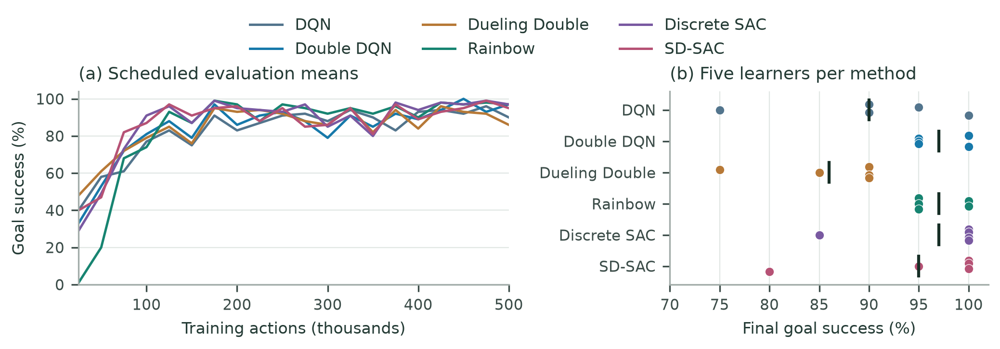
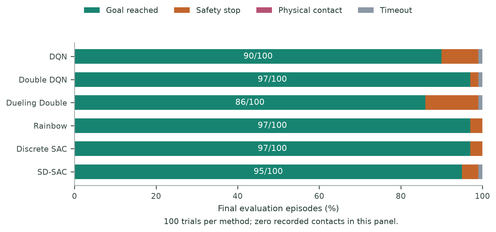
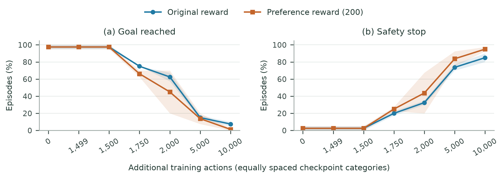
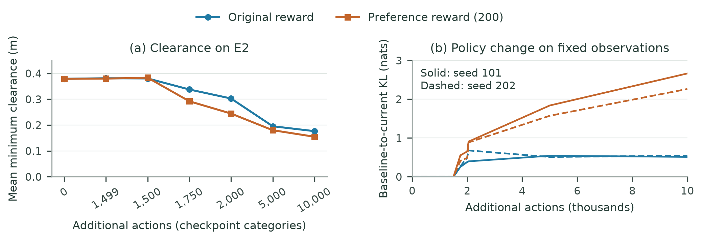
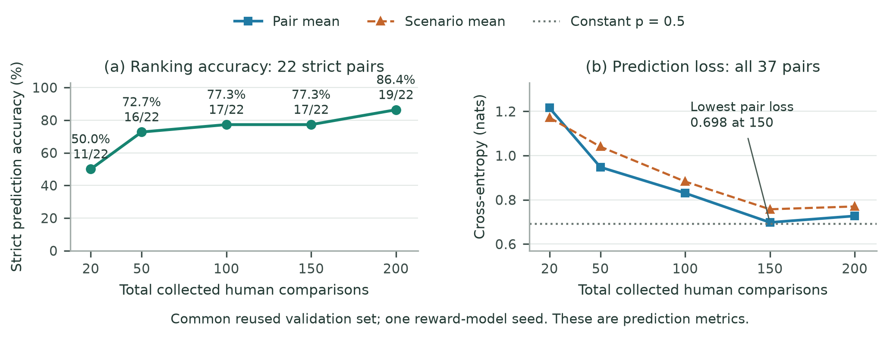

# TurtleBot3 RLHF

## Discrete-action navigation and human preference learning

TurtleBot3 RLHF brings together six reinforcement-learning algorithms, TurtleBot3
simulation, human-preference reward modeling, and navigation evaluation in one
research repository. The study asks how a robot can adapt to human preferences
while retaining its ability to reach goals and navigate around obstacles.

[Package overview](#package-overview) · [Getting started](#getting-started)
· [Problem formulation](#problem-formulation) · [Evaluation results](#navigation-benchmark)
· [Results dashboard](benchmarks/index.html) · [Evaluation guide](docs/EVALUATION.md)
· [Software citation](CITATION.cff)

## Package overview

| Component | Contents |
| --- | --- |
| [Navigation source](turtlebot3_drl_nav/) | Discrete-action learners, observations, episode control, recording, and validation |
| [Algorithm packages](packages/) | Six algorithm-specific configurations, ROS launch files, simulation scripts, and cluster runbooks |
| [Preference learning](turtlebot3_drl_nav/algorithms/discrete_sac/preference_learning/) | Comparison datasets, preference loss, and neural reward models |
| [Simulation](simulation/) | Gazebo worlds and ROS launch definitions |
| [Cluster execution](cluster/) | Apptainer and Slurm resources |
| [Robot tools](laptop/) and [command supervisor](pi/) | Offline actor checks, robot runner, and local command supervision |
| [Evaluation](benchmarks/) | Result tables, five figures, a dashboard, and reporting tools |

The algorithm packages organize DQN, Double DQN, Dueling Double DQN, Rainbow DQN,
Discrete SAC, and SD-SAC within the same repository. Each has its own runtime
configuration and experiment outputs; follow the selected package's runbook
when training or evaluating a learner.

## Getting started

Clone the complete repository:

```bash
git clone https://github.com/DRa709/Turtlebot3_RLHF.git
cd Turtlebot3_RLHF
```

For result analysis, use the lightweight [figure-rebuilding workflow](#rebuild-the-reported-figures).
For navigation experiments, select an algorithm package below and follow its
environment and execution instructions. Those runbooks specify ROS 2 Foxy,
Gazebo 11, container setup, calibration, and training/evaluation commands.
Use the package-specific workspace described there because the algorithm packages
share the ROS package name `turtlebot3_drl_nav`.

| Algorithm | Package guide |
| --- | --- |
| DQN | [DQN setup and execution](packages/TurtleBot_DQN_Random/README.md) |
| Double DQN | [Double DQN setup and execution](packages/TurtleBot_DoubleDQN_Random/README.md) |
| Dueling Double DQN | [Dueling Double DQN setup and execution](packages/TurtleBot_DuelingDoubleDQN_Random/README.md) |
| Rainbow DQN | [Rainbow DQN setup and execution](packages/TurtleBot_RainbowDQN_Random/README.md) |
| Discrete SAC | [Discrete SAC setup and execution](packages/TurtleBot_DiscreteSAC_Random/README.md) |
| SD-SAC | [SD-SAC setup and execution](packages/TurtleBot_SDSAC_Random/README.md) |

The root Python source can be installed with `python -m pip install -e .` in a
suitable environment. ROS/Gazebo deployment also requires the selected package's
dependencies and launch setup. See the [validation scope](docs/EVALUATION.md#validation-scope)
for the checks performed on this repository.

## Problem formulation

We study a partially observed navigation process with latent state $x_t$, observations
$o_t$, dynamics $P(x_{t+1}\mid x_t,a_t)$, observation mapping $O(o_t\mid x_t)$,
initial-state distribution $\rho_0$, reward $r$, and discount $\gamma$.
A reactive categorical policy $\pi(a\mid o)$ selects one of five fixed commands.
The observation vector provides a partial view of the robot and environment.

Given a pretrained policy $\pi_0$ and a total budget $N$ of human comparisons,
fit a preference reward model using the usable fitting pairs, select its checkpoint
with validation data, and continue the policy for a fixed additional action budget $K$.
Annotation count $N$ and policy-training actions $K$ are different resources.

The intended evaluation objective is to improve independent human preference while
retaining goal-reaching ability and limiting contact probability on matched scenarios:

$$\max_{\pi\in\Pi_{\mathrm{disc}}} W_H(\pi,\pi_0)
\quad\text{subject to}\quad
p_G(\pi)\ge p_G(\pi_0)-\delta_G,\qquad p_C(\pi)\le\epsilon_C.$$

$W_H$ is a future blinded human-comparison score (win 1, tie 0.5, loss 0 among
judgeable pairs). $p_G$ and $p_C$ are goal and contact probabilities under a fixed
evaluation scenario distribution. This is the **desired evaluation objective**.
Safety-stop rate and obstacle clearance provide additional measures of navigation behavior.

### Observations and discrete actions

The [implementation](turtlebot3_drl_nav/common/state.py) constructs 41 features:
36 LiDAR ranges divided by the configured LiDAR maximum and clipped to $[0,1]$,
clipped normalized goal distance, sine and cosine of heading error, and two
normalized **previous command** components. Canonical LiDAR bearings run from
$-180^\circ$ to $+170^\circ$ in $10^\circ$ increments; index 18 is forward at
$0^\circ$. Normalization bounds come from the active configuration.

| Action | Command | Linear velocity (m/s) | Angular velocity (rad/s) |
| --- | --- | ---: | ---: |
| 0 | Forward | 0.15 | 0.0 |
| 1 | Forward left | 0.12 | +0.6 |
| 2 | Forward right | 0.12 | -0.6 |
| 3 | Rotate left in place | 0.00 | +1.0 |
| 4 | Rotate right in place | 0.00 | -1.0 |

These are the current `ActionMap` defaults and the study's reference commands.
The policy selects a discrete action ID mapped to the corresponding command.

Terminal outcomes are **physical contact**, **safety stop**, **goal reached**, or
**time-limit truncation**, with contact > stop > goal precedence in the reward
implementation. Default thresholds are 0.16 m for a proximity stop and 0.20 m
for goal tolerance. Stops and physical contacts are recorded as separate outcomes.

## Algorithms

The benchmark evaluates DQN, Double DQN, Dueling Double DQN, Rainbow DQN,
Discrete SAC, and a categorical adaptation of SD-SAC.

- [Discrete SAC](turtlebot3_drl_nav/algorithms/discrete_sac/discretesac.py) uses a
  categorical actor, two action-value critics, and exact sums over five actions.
  Its configuration fixes entropy temperature at `alpha=0.2`.
- [SD-SAC](turtlebot3_drl_nav/algorithms/sdsac/sdsac.py) is a controlled adaptation
  of Zhou et al.'s method with double-average Q learning, an entropy-change penalty,
  and Q clipping.
- Discrete SAC follows [Christodoulou (2019)](https://arxiv.org/abs/1910.07207);
  SD-SAC follows [Zhou et al. (2024)](https://arxiv.org/abs/2209.10081).
  See the source headers and configuration files for implementation details.

## Navigation benchmark

The final Discrete SAC benchmark is **97 goals in 100 trials**. Double DQN and
Rainbow also reach 97%. This evaluation precedes preference-based continuation.

Each of the six methods has five trained learners (seeds 101, 202, 303, 404, 505),
each trained for 500,000 actions. The final primary evaluation contains 20 E1
episodes per learner, or **100 trials per method**. The primary channel is greedy
for the DQN family and deterministic for the SAC family.

<!-- BEGIN RESULTS_BENCHMARK -->
| Method | Goals | Success (%) | Learner SD (pp) | Safety stops | Contacts | Timeouts |
| --- | --- | --- | --- | --- | --- | --- |
| DQN | 90/100 | 90 | 9.35 | 9 | 0 | 1 |
| Double DQN | 97/100 | 97 | 2.74 | 2 | 0 | 1 |
| Dueling Double | 86/100 | 86 | 6.52 | 13 | 0 | 1 |
| Rainbow | 97/100 | 97 | 2.74 | 3 | 0 | 0 |
| Discrete SAC | 97/100 | 97 | 6.71 | 3 | 0 | 0 |
| SD-SAC | 95/100 | 95 | 8.66 | 4 | 0 | 1 |
<!-- END RESULTS_BENCHMARK -->

The final Discrete SAC counts are **20 + 20 + 17 + 20 + 20 = 97 goals**, with three
safety stops, no timeouts, and no recorded physical contacts. Its five learner
rates are 100%, 100%, 85%, 100%, 100% (sample SD 6.71 percentage points).



Curves use 20 scheduled checkpoints at 25,000-action intervals. Requested cases
match across methods within a checkpoint/episode block but change between checkpoints.
Across all checkpoints there are 12,000 primary evaluations; stochastic evaluation
of the two SAC methods adds 4,000. The final result uses the 100 primary trials
per method. Lines connect recorded checkpoint means; final dots show all five
learners and black marks show their means.




## Preference-based continuation: observed outcomes

Two selected pretrained Discrete SAC actors (seeds 101 and 202) were continued
for 10,000 additional actions. Both conditions transferred **only the actor**,
with fresh critics, optimizers, and replay. One used the original reward; the
other used a fixed reward learned from 200 collected human comparisons.

The E2 development panel pools 20 scenarios, two learners, and two action-selection
modes: 80 trials per checkpoint. E2 uses a separate scenario panel from E1.

<!-- BEGIN RESULTS_CONTINUATION -->
| Condition | Goals | Success (%) | Safety stops | Contacts | Timeouts |
| --- | --- | --- | --- | --- | --- |
| Frozen baseline | 78/80 | 97.5 | 2 | 0 | 0 |
| Original reward, +10k actions | 6/80 | 7.5 | 68 | 0 | 6 |
| Preference reward (200), +10k actions | 1/80 | 1.25 | 76 | 0 | 3 |
<!-- END RESULTS_CONTINUATION -->



Both continuations lose goal-reaching ability. At 10,000 additional actions,
preference continuation has 1.25% goal success versus 7.5% under the original
reward. Shading shows the range of two learner rates. Uneven action counts are
displayed as checkpoint categories.



Mean episode-minimum clearance falls from 0.379 m to 0.176 m with original reward
and 0.155 m with preference reward. Across the 1,144 checkpoint evaluations
(E2 plus the small E3 panel), there are zero recorded contacts. KL curves describe
the categorical policy's change on a fixed observation set.

## Human-comparison budgets: reward prediction

<!-- BEGIN RESULTS_COMPARISONS -->
| Collected comparisons | Fitting pairs | Correct / strict pairs | Accuracy (%) | Pair cross-entropy |
| --- | --- | --- | --- | --- |
| 20 | 15 | 11/22 | 50.00 | 1.216 |
| 50 | 36 | 16/22 | 72.73 | 0.948 |
| 100 | 75 | 17/22 | 77.27 | 0.830 |
| 150 | 109 | 17/22 | 77.27 | 0.698 |
| 200 | 143 | 19/22 | 86.36 | 0.727 |
<!-- END RESULTS_COMPARISONS -->



Accuracy uses the **same 22 strict validation pairs**; cross-entropy uses all 37
pairs including 15 ties. The validation set was reused for model selection, and
one reward-model seed is available. Total comparison budgets include fitting,
validation, and unjudgeable responses.

Strict accuracy increases from 50.00% to 86.36%, with a plateau from 100 to 150.
Cross-entropy is lowest at 150 comparisons and worsens at 200. **Navigation was
evaluated only at 200 comparisons.**

The next hypothesis is that, after establishing stable continuation, more
informative comparisons can improve goal completion and obstacle avoidance while
retaining baseline competence. Test separate copies of the same baseline at each
budget with equal additional training actions, matched scenarios, separate final
tests, and repeated policy/reward-model seeds.

## Limitations

The benchmark describes the evaluated scenarios, with three methods tied at 97%.
Contacts were measured with an active stopping mechanism. Both actor-only
continuations lost goal success, so reward choice is not isolated as the cause.
Reward-prediction results reuse a validation set and one reward-model seed;
navigation gains across comparison budgets, obstacle-recognition improvements,
route smoothness, and physical-robot gains remain unmeasured. The goal-retention
constraints above were not enforced, their thresholds were not set in advance,
and fresh human comparisons of the adapted policies were not collected.

## Rebuild the reported figures

Python 3.8+ with NumPy, pandas, and Matplotlib is sufficient for the report:

```bash
python -m pip install numpy pandas matplotlib
python benchmarks/build_report.py
python -m pip install pytest
python -m pytest tests/test_benchmark_reporting.py tests/test_pomdp_contracts.py tests/test_geometry.py -q
```

This rebuilds the tables, dashboard, and plots from the included result summaries.
It checks the data manifest and accounting consistency. The [data guide](results/README.md)
describes each table and the verification steps.

`generate_benchmark_suite.py` is a separate **training-episode** exploration tool:

```bash
python benchmarks/generate_benchmark_suite.py --input-dirs /path/to/recorded/runs --output-dir /path/to/training-report
python benchmarks/generate_benchmark_suite.py --demo --output-dir /path/to/preview
```

Synthetic previews are labeled and stored under `synthetic_demo`. Training reports
show rolling success and first threshold crossings; evaluation reports use the
specified held-out trials.

## Availability and reproducibility

The navigation package, preference-learning components, simulation assets,
evaluation summaries, and figure-generation tools are provided in this repository.
**Experiment-specific code is available upon request.** The included summaries
reproduce the reported figures. Exact reproduction of the recorded experiments
also requires their checkpoints, configurations, containers, and deployment records;
equivalence to every source component in this repository has not been established.
See the [evaluation guide](docs/EVALUATION.md) for provenance, completed checks,
and the scope of simulation and physical-robot validation.

### Reset validation and experiment versions

Commit [62f5136](https://github.com/DRa709/Turtlebot3_RLHF/commit/62f51367187cbb764145d3fecf285520f116c41e)
changed reset acceptance in the episode engine and offline validator. It makes
membership in the declared starting region independent of pose-error tolerance.
The preceding public version,
[f84b84d](https://github.com/DRa709/Turtlebot3_RLHF/tree/f84b84de7793512fce01d79833e78c4d86813c4c),
passed the position/odometry tolerance as a margin to `sampler.admissible`:

| Check | Public code at `f84b84d` | Public code from `62f5136` |
| --- | --- | --- |
| Realized-position support | `admissible(x, y, margin=init_position_tolerance)`; configured margin 0.03 m | `admissible(x, y)`; zero margin |
| Odometry-position support | `admissible(x, y, margin=init_odom_tolerance)`; configured margin 0.05 m | `admissible(x, y)`; zero margin |

The earlier margins expanded the x/y bounds and reduced the required static and
swept-obstacle clearance; they did not relax the goal-exclusion radius. Separate
pose-error tolerances, the initial LiDAR-clearance check, and the E3 fixed-start
exemption from support membership remain unchanged. An existing reset regression
showed that a 0.029 m position shift could leave the declared region while passing
the earlier check; this motivated the change.

**The navigation results in `results/` predate this change and have not been
regenerated or revalidated with the current reset predicate.** The CSV values and
reported outcome counts are unchanged. The current validator can reject a reset
that the preceding public validator accepted; passing software tests does not
establish historical-run compatibility or new navigation results.

Exact historical reproduction requires each run's archived source, configuration,
container, and validation records. The preceding public commit identifies a code
version, not a verified deployment for every ARC run. Do not infer the historical
predicate from the current source or an `init_support_ok` flag alone. When
revalidating archived episodes with a different predicate, report that as a
separate check and retain the original evaluation cohort and outcomes.

## Authors and citation

- **Asha Barua** — [@ashabarua](https://github.com/ashabarua), ashabarua@vt.edu.
- **Dhruv Shankar Ray** — [@DRa709](https://github.com/DRa709), package maintainer.

Use the following citation for the software.

```bibtex
@software{baruaandray2026turtlebot3rlhf,
  author = {Barua, Asha and Ray, Dhruv Shankar},
  title = {Deep Reinforcement Learning & Preference Navigation Suite for TurtleBot3},
  year = {2026},
  publisher = {GitHub},
  howpublished = {\url{https://github.com/DRa709/Turtlebot3_RLHF}}
}
```

When citing a specific result, identify its evaluation cohort and the repository
commit/release containing the reported tables. See [CITATION.cff](CITATION.cff).

The authors wrote the navigation, training, and evaluation code and used OpenAI
Codex to debug and fix it. The experiments were run on the ARC cluster, the recorded
results were saved as the CSV files under `results/`, and the
figures were generated locally from those files.
